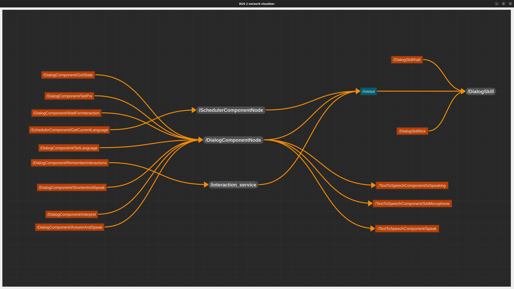

# Dialog Skill

The dialog pipeline is supposed to define the sequences of actions of a generic conversation between the robot and the user. In the context of Palazzo Madama, the robot is assumed to have conversations with visitors as a tour guide. For this reason, the dialog is settled as a question-answer dialog, where visitors are supposed to ask information about anything related the museum, the tour and the robot itself, while the robot is supposed to provide answers and wait for other questions or deciding when continuing the tour.

# State Machine
<!--  -->

    

The dialog skill behavior follows the flow chart presented above:
- The starting state is `IDLE`
- If a tick is received, then the `WaitForInteract` state is supposed to wait for the text and to pass it to the next state. If not, wait. When a text interaction is received, go to the next state.
- The `SetLanguage` state takes the interaction and sets the language based on the question (Does it make sense? Couldn't we use the LLM just reply in the language of the question?). Then go to the next state
- The `ManageContext` state receives the interaction and based on the context, it delivers the request to a specific LLM, or directly replies with predefined actions. If the context requires a specific LLM, then go to the `CheckDuplicate` state, otherwise go to the `RunUntilEndSpeaking` state.
- The `CheckDuplicate` state is supposed to recognize if the semantical meaning of the received question sentence has already been heard within the dialog.
- If it's the first time that the question has been asked, then go to the `Interpret` state, which is supposed to understand if the sentence is another question or the invite to continue the tour. If the sentence is a question, then go to the `AnswerAndSpeak` state, otherwise it means that one among the invitation to continue, starting or ending the tour has been received, therefore come back to the `IDLE` state.
- If a similar question has already been asked within the dialog session, the `ShortenAndSpeak` is supposed to provide a resumed version of the previous answer, rather than replying the same information. After generating the answer, speak and at the end of the speech, come back to the state `WaitForInteraction`
- The `AnswerAndSpeak` state is supposed to generate an answer and to estate it verbally. Analogously to the `ShortenAndSpeak` state, at the end of the speech, come back to the `WaitForInteraction` state
- The `RunUntilEndSpeaking` state is supposed to wait for the end of the speech, and then come back to the `WaitForInteraction` state. This state is used to manage the speech synthesis, which is asynchronous and requires a specific management.

# Components
The dialog skill represents a ROS2 node acting as a ROS2 Service Client, which interacts with the following components, implementing ROS2 Service Servers:
- **Dialog Component**: The dialog component provides the majoirity of the services required by the dialog skills, except for the speech synthesis, the speech recognition and the language settings. The dialog component is responsible to manage the dialog session, to provide the answer to the questions and to manage the dialog state. The dialog component is also responsible to manage the LLM, which is used to generate the answers.
- **Scheduler Component**: The scheduler component is responsible to provide the language of the conversation, based on the tour settings.

The Dialog Component also implements ROS2 Service Clients that interact with other components implementing ROS2 Service Servers:
- **Text-To-Speech Component**: The text to speech component is responsible to provide the speech synthesis service, which is used to generate the speech from the text.
- **Scheduler Component**: The scheduler component is responsible to provide the POI of the tour, and ...

Below is a graphical representation of the components and their interactions. Here, grey boxes represent ROS2 nodes, orange boxes represent ROS2 services and blue boxes represent ROS2 topics. If the ROS2 service is on the left side of the box, it means that the service is provided by the node (i.e., the node implements them as ROS2 services server), otherwise it means that the service is required by the node (i.e., the node implements them as ROS2 service clients).

    <figure>
    
    <figcaption>ROS2 services of Dialog Component and Skill (last update: April 29th, 2025)</figcaption>
    </figure>

