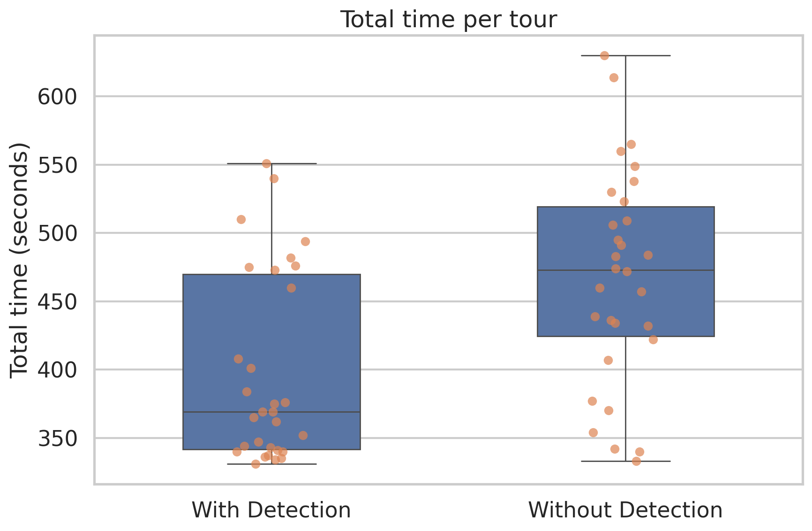
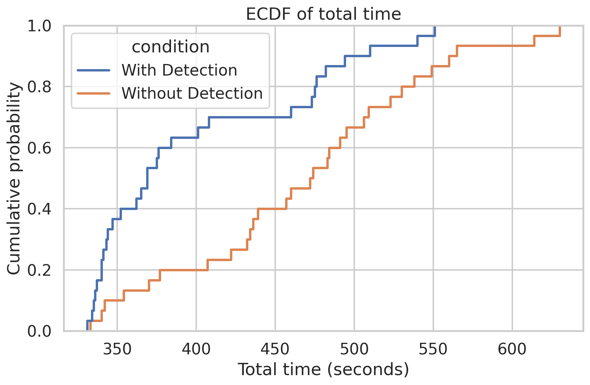
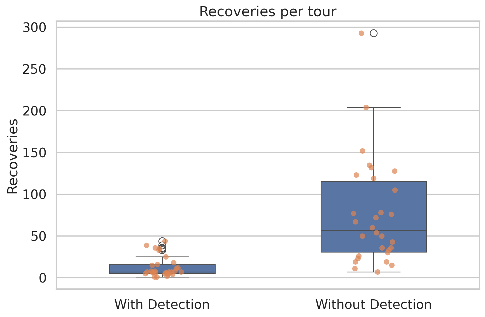
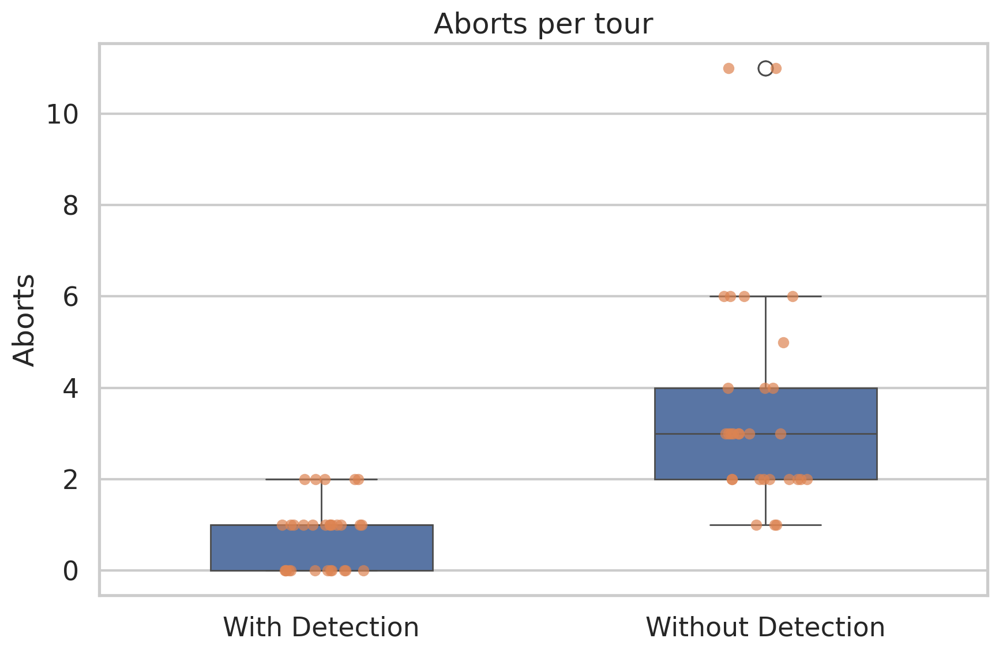
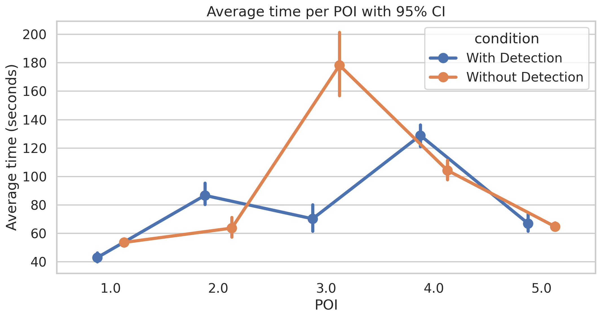
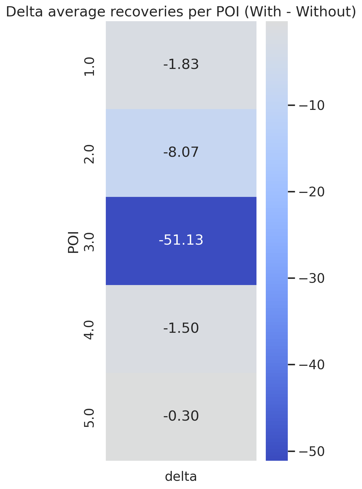
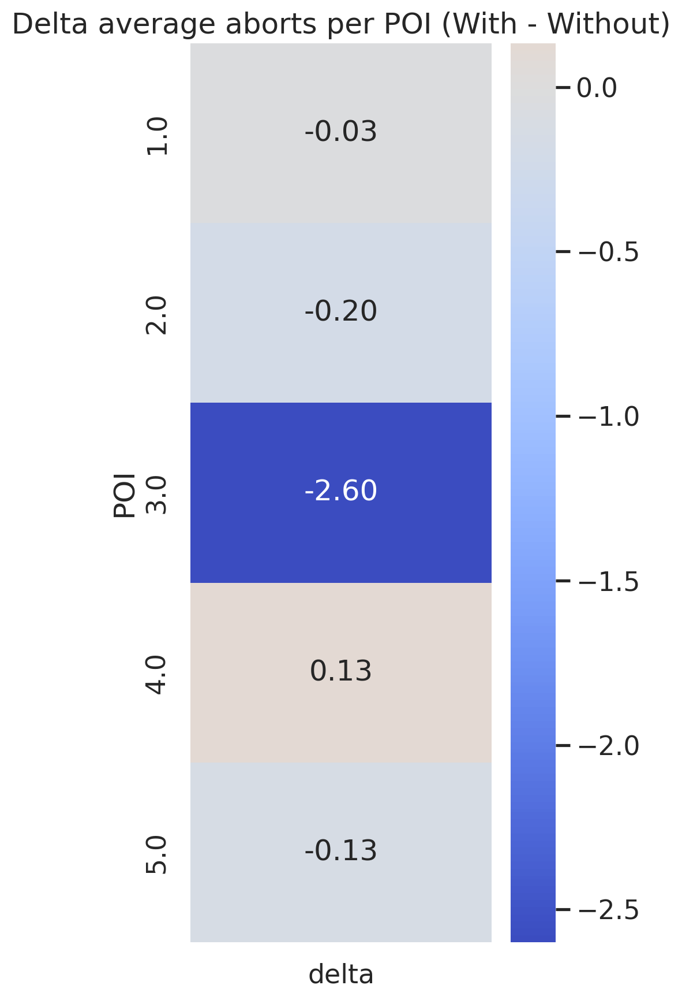

# Report to show the improvements introduced in the tour when planning using detection

## Aim
To evaluate the impact of the planner on the performance of the overall system along the tour, by comparing to conditions:Ù

- **With Detection**
- **Without Detection**

The analyzed metrics are:

- **total time per tour**
- **recoveries per tour**
- **aborts per tour**
- **trend per POI**

The analyzed dataset comprises:

- **30 tour** considering the detections
- **30 tour** neglecting the dectections

#### The use of detections affects the planner’s POI selection only in the first three rooms. In contrast, for POIs 4 and 5 the planner makes the same choice in both experimental conditions. As a consequence, any lack of improvement in the last two rooms should not be interpreted as a failure of the detection mechanism itself, but rather as the result of identical planning decisions in that portion of the tour.
---

## Summary of the resulsts
Overall, the **With Detection** condition shows better performance than **Without Detection**.

More in detail:

- the average **total time** is reduced by approximately **60.7 seconds** per tour;
- both the **recoveries** and the **aborts** decrease markedly;
- the highest benefits can be seen in the **POI 3**, which results to be the most critical part when ignoring the detection.

Moreover, analyzing the inference of the metrics, all of the three metrics results to have differences which are **statistically significative**. 

- **total time**: `p = 0.0046`
- **recoveries**: `p = 3.81e-08`
- **aborts**: `p = 1.96e-09`

---

## 1. Main descriptive statistics

| Metric | With Detection | Without Detection |
|---|---:|---:|
| Average total time (s) | 405.43 | 466.16 |
| Median of total time (s) | 372.00 | 472.00 |
| Average recoveries | 13.40 | 74.23 |
| Median recoveries | 7.50 | 54.00 |
| Average aborts | 0.77 | 3.61 |
| Median aborts | 1.00 | 3.00 |

### Interpretation
Descriptive statistics show a significant advantage of the **With Detection** condition on all metrics considered. The difference is particularly noticeable for **recoveries** and **aborts**, while for **total time** the improvement is still substantial and compatible with greater overall system efficiency.

---

## 2. Total time per tour

### Figure 1 — Total time per tour box plot

The boxplot shows that the distribution of **total time** under the *With Detection* condition is shifted toward lower values than under *Without Detection*. The median is lower and the central part of the distribution also appears more favorable overall.
This graph suggests that using detection reduces the time it takes to complete the tour. The advantage is not limited to a few isolated cases, but concerns the entire distribution quite widely.

---

### Figure 2 — ECDF of the total time

The ECDF curve of the **With Detection** condition is largely shifted to the left of the **Without Detection** condition. This means that, given the same time threshold, there is a greater number of tours with detection which end earlier. 
ECDF confirms that time reduction is not a marginal effect. Detection improves the probability of completing the tour within lower time thresholds, strengthening the evidence observed in the boxplot.

---

## 3. Recoveries per tour

### Figure 3 — Boxplot of recoveries per tour

When **considering the detection** the recoveries' distribution results to be lower and more concentrated. Instead, **without detection** condition shows more elevated average values and a wide dispersion.This is one of the most significant result of the analysis: the detection reduces markedly the recoveries necessity. Consequently, the behaviour is more stable and requires less corrections during the tour.

---

## 4. Aborts per tour

### Figure 4 — Boxplot of aborts per tour

Aborts in the **With Detection** condition are generally very low, often close to zero or one. In the **Without Detection** condition the distribution is clearly higher and more variable.
Detection reduces even the most critical events. This is particularly relevant because abortions represent a more severe indicator of instability than recoveries.

---

## 5. Analisi per each POI

### Figure 5 — Average time per POI with CI95%

The graph shows the mean time for each POI under the two conditions, with a 95% confidence interval. The most noticeable difference is observed in **POI 3**, where the *Without Detection* condition has a much higher mean time.
Detection does not uniformly improve all segments of the path. The main benefit is concentrated in **POI 3**, which appears to be the most problematic trait in the absence of detection. In other POIs, smaller differences are observed, and in some cases even a slight increase in detection time.

---

### Figure 6 — Heatmap of the delta of the average recoveries per POI (*With - Without*)

Recoveries deltas are all negative, so detection reduces recoveries in each POI. The most marked improvement is observed in **POI 3**.
Consequently, detection improves the robustness of the system along the entire path, but the dominant effect is once again concentrated in the **POI 3**. This confirms that the most critical trait is also the one in which the detection module offers the greatest benefit.

---

### Figure 7 — Heatmap of the delta of the average aborts per POI (*With - Without*)

Even for abortions, deltas are predominantly negative:
Again, the reduction of the abortions is very strong in the **POI 3**, while in the other POIs the differences are more limited.

---

## 6. Riassunto inferenziale

| Metric | p-value |
|---|---:|
| Tempo totale | 0.0046 |
| Recoveries | 3.81e-08 |
| Aborts | 1.96e-09 |

### Interpretazione
The three metrics show statistically significant differences in favor of the **With Detection** condition. The effect is particularly strong for **recoveries** and **aborts**, while for **total time** the effect is still consistent and consistent with a significant operational reduction.

---

## 7. Conclusioni
The analysis highlights that the **With Detection** condition clearly improves system performance compared to **Without Detection**.

In particular:

- reduces the **total time** of completing the tour;
- reduces the number of **recoveries** very significantly;
- significantly reduces the number of **aborts**;
- focuses its benefit especially on **POI 3**, which represents the main critical point of the path in the absence of detection.

Overall, the results suggest that the introduction of detection increases the **robustness** of the system and improves the overall **efficiency** of the tour. Although a slight increase in average time is observed in some POIs, the final balance remains clearly favorable to the **With Detection** condition.

---